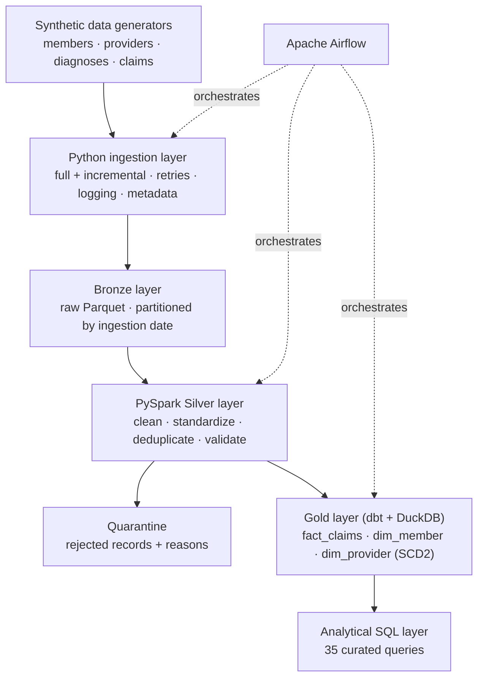
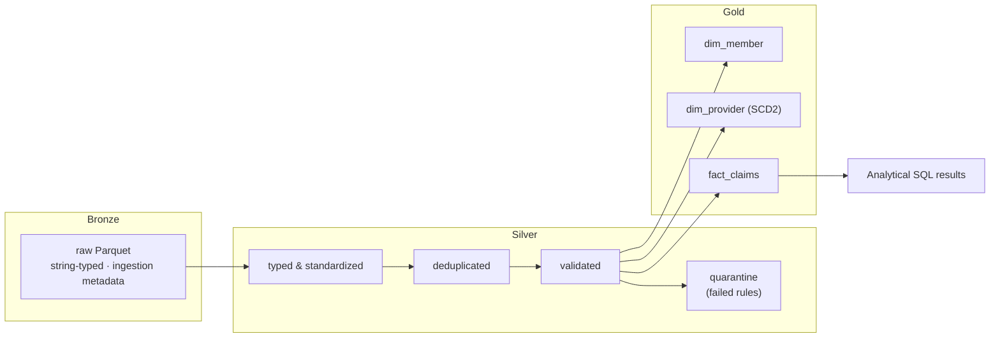
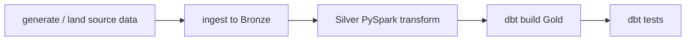
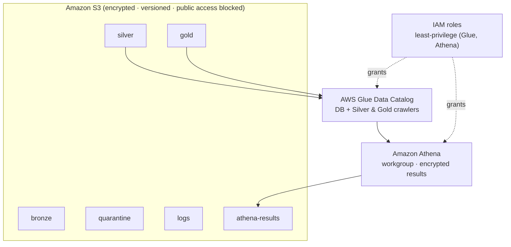

# ClaimsLake — Healthcare Claims Data Engineering Platform

> An end-to-end, production-style data pipeline that ingests, cleans, models, and analyzes **synthetic** healthcare claims data on a medallion (Bronze → Silver → Gold) architecture.

### 🔗 [**Live Demo →**](https://claimslake.vercel.app) &nbsp;·&nbsp; a recruiter-facing walkthrough of this pipeline's architecture, engineering decisions, and analytics (source in [`webapp/`](webapp))

[](https://github.com/Gundabathina/claimslake/actions/workflows/ci.yml)
[](https://github.com/Gundabathina/claimslake/actions/workflows/terraform.yml)
[](LICENSE)

## Overview

ClaimsLake is a portfolio data-engineering project that demonstrates how raw, messy healthcare claims files are turned into trustworthy, analytics-ready tables. It combines Python ingestion, PySpark transformations, a dbt star schema, an analytical SQL layer, Airflow orchestration, containerization, CI, and a Terraform AWS reference architecture — all runnable locally with **synthetic data only**.

**All data in this repository is synthetic**, generated to resemble realistic healthcare claims structures (similar in spirit to CMS synthetic public-use files and the Synthea generator). No real patient, member, or provider data is used anywhere.

## Business problem

Insurers and providers process large volumes of claims that arrive messy, duplicated, and inconsistent across source systems. Analysts need clean, well-modeled data to answer questions such as which providers have the highest denial rates, which diagnoses drive the most cost, and whether claim processing times are degrading. ClaimsLake shows how a data engineer builds the pipeline that makes those answers reliable.

## Architecture overview

ClaimsLake follows the medallion pattern. Synthetic source files are ingested into a raw **Bronze** layer, cleaned and standardized into a validated **Silver** layer (with a quarantine path for bad records), and modeled into a **Gold** star schema with dbt. An analytical SQL layer runs on top of Gold, Airflow orchestrates the stages, and a Terraform reference architecture describes how the same design would map to AWS (S3 + Glue + Athena).

### High-level architecture



### End-to-end data flow



### Airflow orchestration flow



### AWS Terraform reference architecture



> The Terraform is a **reference architecture only**. It is CI-validated but has **never been planned or applied**, so it creates no AWS resources or costs. See [`terraform/README.md`](terraform/README.md).

## Technology stack

| Layer | Technology | Purpose |
|---|---|---|
| Language | Python 3.11 | Ingestion, utilities, tests |
| Processing | PySpark | Bronze → Silver transformations |
| Lake storage | Parquet (local); MinIO (S3-compatible) | Columnar storage, local S3 substitute |
| Modeling | dbt (dbt-duckdb) | Gold star schema, tests, docs |
| Local warehouse / query engine | DuckDB | Reads Silver Parquet directly; runs Gold + analytics |
| Orchestration | Apache Airflow | DAG scheduling, retries, dependencies |
| Analytics | SQL | 35 curated analytical queries |
| Containerization | Docker & Docker Compose | Reproducible local environment |
| IaC | Terraform (AWS: S3, Glue, Athena, IAM) | Cloud reference architecture (not applied) |
| CI | GitHub Actions | Tests + dbt parse + Terraform validation |
| Testing | pytest, dbt tests | Unit and data-quality testing |

## Key engineering capabilities

- Config-driven ingestion with full/incremental loads, retry handling, structured logging, and per-batch metadata tracking.
- Schema validation with a **quarantine** path so bad records are isolated with reasons instead of silently dropped.
- PySpark Silver layer that types, standardizes, deduplicates, and validates every dataset.
- Slowly-changing-dimension (SCD2) history for providers.
- Gold star schema modeled in dbt with tests, built directly from Silver Parquet via DuckDB.
- A curated analytical SQL layer (35 queries) across members, providers, claims, finance, and data quality.
- Airflow DAG wiring the stages end to end.
- Multi-job GitHub Actions CI plus a path-filtered Terraform validation workflow.

## Repository structure

```
claimslake/
├── ingestion/        Python ingestion layer (config-driven, Bronze load)
├── spark_jobs/       PySpark Silver transformation code
├── processing/       bronze / silver / gold processing notes
├── dbt/              dbt project (Gold star schema + tests)
├── sql/              analytical SQL layer (members, providers, claims, finance, data_quality)
├── airflow/          Airflow DAG definitions
├── terraform/        AWS reference infrastructure (S3, Glue, Athena, IAM)
├── scripts/          data generation + full pipeline runner
├── tests/            pytest suites (ingestion, pyspark, sql, scripts, airflow)
├── data/sample/      sample synthetic source data
├── docker/           Dockerfile
├── docs/             architecture, lineage, data dictionary, analytics catalog, interview guide
├── webapp/           public recruiter-facing web app (React/Vite) — deployed at claimslake.vercel.app
└── docker-compose.yml
```

## Dataset descriptions

All datasets are synthetic. Sample files live in [`data/sample/`](data/sample).

| Dataset | Grain | Key fields |
|---|---|---|
| members | one row per member | member_id, date_of_birth, gender, plan_type, state, enrollment dates |
| providers | one row per provider version | provider_id, provider_name, specialty, npi, network_status, effective_date |
| diagnoses | one row per diagnosis code | diagnosis_code, diagnosis_description, category |
| claims | one row per claim | claim_id, member_id, provider_id, diagnosis_code, service_date, billed_amount, paid_amount, claim_status, denial_reason |

## Quick start

```bash
# 1. Create and activate a virtual environment (Python 3.11)
python -m venv .venv && source .venv/bin/activate

# 2. Install dependencies
pip install -r requirements.txt

# 3. Generate synthetic source data
python scripts/generate_synthetic_data.py

# 4. Run the full Bronze -> Silver -> Gold pipeline
python scripts/run_pipeline.py
```

A `Makefile` wraps the common tasks: `make generate-data`, `make ingest`, `make pipeline`, `make test`, `make dbt-run`, `make dbt-test`, `make up`, `make down`.

## Local pipeline execution

```bash
# Bronze ingestion only
python ingestion/run_ingestion.py

# Full pipeline: Bronze -> Silver -> Gold (dbt)
python scripts/run_pipeline.py
```

> PySpark requires a local JDK (Java 17 recommended).

## Docker execution

A `docker-compose.yml` defines the local stack (MinIO, Postgres, Airflow).

```bash
make up      # start the stack (docker compose up -d)
make down    # stop the stack
```

> **Docker Compose full-stack: verified locally.** A full `docker compose down -v && docker compose up --build` run brings the stack up successfully — Postgres becomes healthy, the Airflow metadata database is initialized, `airflow-init` completes, the webserver and scheduler start, and the PySpark test suite passes inside the app container (17/17). See [`docker/README.md`](docker/README.md).

## Running tests

```bash
# Full test suite
pytest tests/ -v

# Targeted suites
python -m pytest tests/ingestion -v   # Bronze ingestion
python -m pytest tests/pyspark -v     # PySpark Silver (requires JDK 17)
python -m pytest tests/sql -v         # SQL analytics checks
python -m pytest tests/airflow -v     # Airflow DAG structure
```

## SQL analytics usage

The [`sql/`](sql) layer contains 35 curated analytical queries grouped by domain (members, providers, claims, finance, data_quality). A master runner is provided:

```bash
# Example with DuckDB CLI against the Gold outputs
duckdb < sql/run_all.sql
```

See [`docs/analytics_catalog.md`](docs/analytics_catalog.md) for the full query catalog.

## dbt usage

The Gold star schema is built with **dbt-duckdb**, which reads the Silver Parquet outputs directly (no separate load step).

```bash
cd dbt
dbt run     # build Gold models (dim_member, dim_provider, fact_claims)
dbt test    # run schema/data tests
```

## Airflow orchestration

The DAG in [`airflow/dags/claimslake_pipeline.py`](airflow/dags/claimslake_pipeline.py) wires the stages (ingest → Silver → dbt build → dbt test). It can be run via the Docker Compose Airflow services (`make airflow-up`).

## Terraform reference architecture

The [`terraform/`](terraform) directory defines an AWS data-lake reference architecture (S3 layers, Glue Data Catalog + crawlers, Athena workgroup, least-privilege IAM), organized into `s3`, `iam`, `glue`, and `athena` modules.

```bash
cd terraform
terraform fmt -check -recursive
terraform init -backend=false
terraform validate
```

> `terraform plan`/`apply` require AWS credentials. This architecture is **reference-only and has never been applied** — it creates no resources or costs. Details in [`terraform/README.md`](terraform/README.md).

## Data quality and quarantine handling

The Silver layer validates every record against business rules. Records that fail (for example future dates of birth, invalid state codes, or malformed keys) are routed to a **quarantine** path with the reason attached, rather than being dropped. Non-fatal issues (such as a missing ZIP) are flagged with data-quality columns but retained. Data-quality queries in [`sql/data_quality/`](sql/data_quality) summarize the results.

## Sample outputs

Illustrative schemas below are based strictly on implemented columns (synthetic data). See [`docs/data_dictionary/silver_schemas.md`](docs/data_dictionary/silver_schemas.md) for the full dictionary.

**Silver `members` (standardized):**

| member_id | gender | state | plan_type | has_missing_zip |
|---|---|---|---|---|
| M0001 | F | CA | PPO | false |

**Quarantined record (illustrative):**

| record_key | dataset | quarantine_reason |
|---|---|---|
| M0042 | members | date_of_birth in the future |

**Gold `fact_claims` (illustrative):**

| claim_id | member_id | provider_id | billed_amount | paid_amount | claim_status |
|---|---|---|---|---|---|
| C10001 | M0001 | P0007 | 1200.00 | 950.00 | PAID |

> These rows are illustrative placeholders showing the shape of the output, not committed execution results.

## Current project status

| Milestone | Status |
|---|---|
| Repository scaffolding | ✅ Complete |
| Synthetic data generation | ✅ Complete |
| Bronze ingestion (Python) | ✅ Complete |
| Silver transformations (PySpark) | ✅ Complete |
| Gold star schema (dbt-duckdb) | ✅ Complete |
| Analytical SQL layer | ✅ Complete (35 queries) |
| Airflow orchestration | ✅ Complete |
| Expanded GitHub Actions CI | ✅ Complete (4 jobs green) |
| Terraform AWS reference architecture | ✅ Complete (CI-validated, never applied) |
| End-to-end local execution | ✅ Complete |
| Docker Compose full-stack | ✅ Complete (verified locally) |
| Streaming (Kafka) | ⚪ Optional future enhancement |
| AWS deployment | ⚪ Reference architecture only — not applied |

### Verified results

- Bronze ingestion: 26 tests passing (verified locally).
- PySpark Silver: 17 tests passing (verified locally).
- dbt: PASS=14 (verified locally).
- SQL analytics: 35 curated queries.
- Airflow DAG tests: 7 passing (verified locally).
- CI (GitHub Actions): four application jobs green — unit-tests, pyspark-tests, airflow-tests, dbt-checks.
- Terraform CI: `fmt -check -recursive`, `init -backend=false`, and `validate` green.
- Terraform was never planned or applied.

## Limitations

- All data is synthetic; no real claims data is used.
- The Terraform architecture is reference-only and has not been deployed; `plan`/`apply` require AWS credentials.
- Streaming is not implemented (optional future work).

## Future improvements

- Publish a short screen-capture / walkthrough of the full `docker compose up` stack running.
- Optional Kafka streaming demo for near-real-time claim events.
- Expand dbt tests and add exposures/docs generation.

## Interview talking points

- Why the medallion (Bronze/Silver/Gold) architecture fits claims data.
- Quarantine-vs-drop tradeoffs for data quality.
- SCD2 modeling for provider history.
- Using dbt-duckdb to model Gold directly from Parquet without a separate load.
- Structuring multi-job CI and a path-filtered Terraform validation workflow.
- Designing a least-privilege AWS reference architecture without deploying it.

See [`docs/interview_guide/`](docs/interview_guide) and [`docs/portfolio_content.md`](docs/portfolio_content.md).

## Author

Built by **Gundabathina** as a data-engineering portfolio project. All data is synthetic.

## License

Released under the MIT License. See [`LICENSE`](LICENSE).
