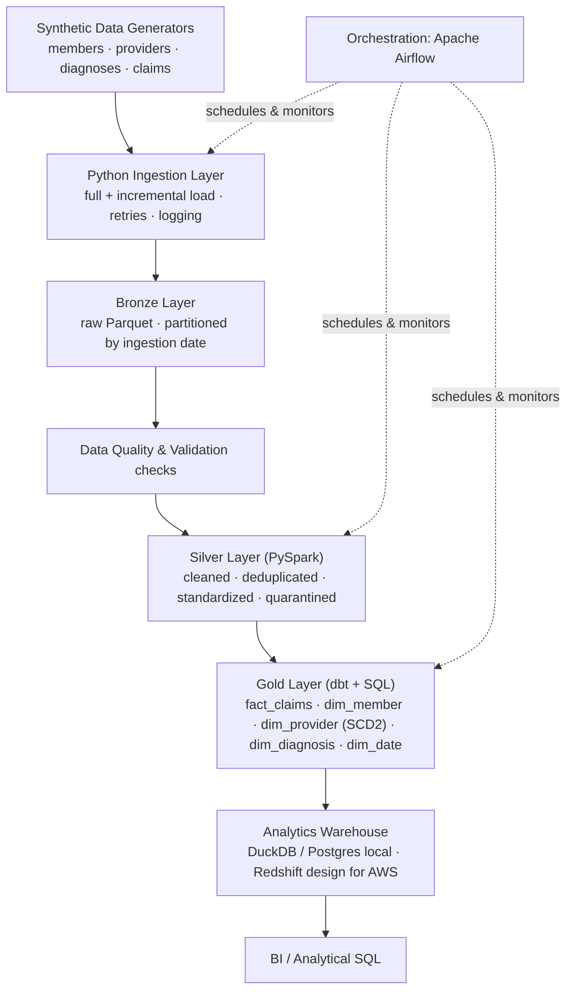

# ClaimsLake — Healthcare Claims Data Engineering Platform

**Status:** Actively under construction (portfolio project, built incrementally in public commits). This README is updated at every milestone.

An end-to-end, production-style data engineering platform that ingests, cleans, models, and analyzes **synthetic** healthcare claims data using a medallion (Bronze/Silver/Gold) architecture.

## Why this project exists

Health insurers and providers process huge volumes of claims data every day, arriving messy, duplicated, and inconsistent across source systems. Analysts need trustworthy, well-modeled data to answer questions such as which providers have the highest denial rates, which diagnoses drive the most cost, and whether processing times are degrading. ClaimsLake demonstrates how a data engineer would build the pipeline that turns raw claims data into analytics-ready tables.

**All data used in this project is synthetic**, generated to resemble realistic healthcare claims structures (similar in spirit to CMS synthetic public-use files and the Synthea patient generator). No real patient, member, or provider data is used anywhere in this repository.

## Architecture (high level)

```
Synthetic Data Generators (members, providers, diagnoses, claims)
        |
        v
Python Ingestion Layer (full + incremental load, retries, logging)
        |
        v
Bronze Layer (raw Parquet, partitioned by ingestion date)
        |
        v
Data Quality & Validation checks
        |
        v
Silver Layer (PySpark: cleaned, deduplicated, standardized)
        |
        v
Gold Layer (dbt + SQL: star schema — fact_claims, dim_member, dim_provider (SCD2), dim_diagnosis, dim_date)
        |
        v
Analytics Warehouse (DuckDB/Postgres locally; Redshift design for AWS)
        |
        v
BI / analytical SQL queries

Orchestration: Apache Airflow coordinates every stage above.
CI/CD: GitHub Actions runs lint, unit tests, and dbt tests on every push.
```

Full architecture diagrams and data lineage docs live in [`docs/architecture`](docs/architecture) and [`docs/data_lineage`](docs/data_lineage).

## Architecture diagram



## Technology stack

| Layer | Technology | Purpose |
|---|---|---|
| Language | Python 3.11 | Ingestion, utilities, tests |
| Processing | PySpark | Bronze to Silver to Gold transformations |
| Lake storage | Parquet (local), MinIO (S3-compatible) | Columnar storage, local S3 simulation |
| Orchestration | Apache Airflow (Docker) | DAG scheduling, retries, dependencies |
| Transformation/modeling | dbt | Gold-layer star schema, tests, docs |
| Local warehouse | DuckDB / Postgres | Stand-in for a cloud warehouse |
| AWS reference design | S3, Glue, Redshift, IAM (Terraform, documented) | Production-scale cloud architecture |
| Containerization | Docker & Docker Compose | Reproducible local environment |
| IaC | Terraform | AWS resource definitions (not auto-deployed) |
| CI/CD | GitHub Actions | Lint, tests, dbt tests, build validation |
| Testing | pytest, dbt tests | Unit and data quality testing |
| Streaming (optional demo) | Kafka (local Docker) | Local simulation of real-time claim events, clearly labeled as non-production |

## Repository structure

```
claimslake/
├── docs/                 architecture, data dictionary, lineage, interview guide, screenshots
├── data/                 sample synthetic data
├── ingestion/            Python ingestion scripts
├── processing/           bronze / silver / gold processing code
├── spark_jobs/              PySpark transformation jobs
├── airflow/dags/         Airflow DAG definitions
├── dbt/                  dbt project (staging, marts, tests)
├── sql/                  DDL and analytical SQL
├── streaming/            optional local Kafka demo
├── tests/                pytest unit and data quality tests
├── terraform/            AWS reference infrastructure as code
├── docker/               Dockerfiles
├── scripts/              helper/dev scripts
└── config/               pipeline configuration
```

## Project status / roadmap

- [x] Milestone 0 — Repository scaffolding
- [x] Milestone 1 — Synthetic data generation
- [x] Milestone 2 — Python ingestion layer (Bronze)
- [x] Milestone 3 — PySpark Silver transformations
- [ ] Milestone 4 — Gold star schema via dbt
- [ ] Milestone 5 — Analytical SQL layer
- [ ] Milestone 6 — Airflow orchestration
- [ ] Milestone 7 — Testing suite
- [ ] Milestone 8 — Docker Compose full stack
- [ ] Milestone 9 — GitHub Actions CI/CD
- [ ] Milestone 10 — Terraform AWS reference architecture
- [ ] Milestone 11 — Optional Kafka streaming demo
- [ ] Milestone 12 — Full documentation
- [ ] Milestone 13 — Interview guide

## Running the ingestion layer (Milestone 2)

```bash
pip install -r requirements.txt
python -m ingestion.src.ingestion_engine --all   # load all sources into Bronze
pytest tests/ingestion -v                         # run the ingestion tests
```

The Bronze ingestion framework is configuration-driven and demonstrates full/incremental loads, idempotency (SHA-256 file hashing), retry logic, schema-drift detection, structured logging, and a SQLite ingestion audit log. It preserves source data faithfully in Bronze (Parquet, partitioned by ingestion date) and performs no business transformation. See ingestion/README.md for the full design and docs/interview_guide/02_ingestion_bronze.md for interview Q&A. All data is synthetic.

## Running the Silver layer (Milestone 3)

```bash
pip install -r requirements.txt
python -m ingestion.src.ingestion_engine --all   # SOURCE -> BRONZE
python -m spark_jobs.src.silver_pipeline --all        # BRONZE -> SILVER
pytest tests/pyspark -v                            # run the PySpark tests
```

The PySpark Silver layer reads Bronze Parquet and produces cleaned, typed, deduplicated, validated datasets under `silver/`, quarantining invalid records (with reasons) under `silver/quarantine/` rather than dropping them, and writing data-quality metrics to `data_quality/metrics/`. It preserves provider historical versions so the Gold layer can later build an SCD Type 2 dimension, normalizes the claims_batch_1/claims_batch_2 schemas, flags late-arriving claims, and checks referential integrity with broadcast joins. Requires a JVM (Java 11/17) for Spark. See spark_jobs/README.md for the full design and docs/interview_guide/03_pyspark_silver.md for interview Q&A. All data is synthetic.

## Bronze to Silver pipeline

The Silver layer (`spark_jobs/src/silver_pipeline.py`) reads raw Bronze Parquet and produces analytics-ready tables through a deterministic, testable sequence of PySpark transformations:

1. **Read** Bronze Parquet with an explicit, all-`StringType` schema that matches the documented Bronze ingestion contract (raw data is never implicitly typed).
2. **Clean** (`cleaners.py`) — trim/normalize strings, convert blanks to `NULL`, cast money and date columns to typed values, normalize state codes, and ensure every expected column exists (including nullable ones like `adjustment_amount`).
3. **Deduplicate** (`deduplication.py`) — drop exact-duplicate rows, then collapse business-key duplicates deterministically, keeping the latest record per key.
4. **Validate** (`validators.py`) — apply data-quality rules; invalid rows are routed to a quarantine set rather than silently dropped, and referential integrity is checked with broadcast joins.
5. **Preserve history** — provider records keep historical versions so the Gold layer can build an SCD Type 2 dimension.
6. **Write** (`writers.py`) — emit clean Silver tables plus data-quality metrics under `data_quality/metrics/`.

## Folder structure

```
claimslake/
├── ingestion/            Python Bronze ingestion layer
│   ├── src/              config loader, file reader, engine, retries, logging, metadata
│   └── config/           sources.yaml (config-driven ingestion)
├── spark_jobs/           PySpark Silver transformation jobs
│   └── src/              cleaners, deduplication, validators, transformations,
│                         schemas, readers, writers, silver_pipeline, spark_session
├── tests/                pytest suites
│   ├── ingestion/        Bronze unit tests
│   └── pyspark/          Silver unit tests (17 tests) + conftest fixtures
├── data/sample/          small synthetic sample CSVs
├── config/               pipeline configuration
├── docs/                 architecture, data dictionary, lineage, interview guide
├── dbt/                  Gold-layer dbt project (upcoming milestone)
├── airflow/dags/         orchestration DAGs
├── docker/               Dockerfiles
├── requirements.txt      pinned Python dependencies
├── pyproject.toml        packaging + pytest configuration
└── Makefile              common developer commands
```

## Data quality validations

Validation runs in the Silver layer and treats data quality as a first-class output, not an afterthought:

- **Referential integrity** — claims must reference a known member and provider (checked via broadcast joins).
- **Domain rules** — member state codes must be valid; a future date of birth is rejected.
- **Amount checks** — claim monetary fields are validated for sane, typed values.
- **Late-arriving data** — claims whose service date falls outside the expected ingestion window are *flagged*, not rejected.
- **Completeness** — a missing ZIP is flagged (not a hard rejection), while structurally invalid rows are quarantined.

Rows that fail hard rules are written to a **quarantine** set and counted in the data-quality metrics, so nothing is silently lost.

## Deduplication strategy

Deduplication happens in two deterministic stages so results are byte-for-byte reproducible:

1. **Exact-duplicate removal** — fully identical rows are collapsed first.
2. **Business-key deduplication** — for rows sharing a business key (e.g. a resubmitted claim with the same `claim_id` but corrected amounts), the record with the latest `ingestion_timestamp` wins. Ties are broken deterministically so the same input always yields the same output.

This mirrors real claims processing, where the same claim is frequently resubmitted with corrections and only the newest version should survive into Silver.

## Late-arriving data handling

Late-arriving claims are a fact of life in healthcare (claims can be submitted weeks after service). ClaimsLake handles them explicitly: rather than dropping records whose service date precedes the ingestion window, the pipeline sets a **late-arrival flag** on the row and preserves it. Downstream Gold models can then decide how to treat late records (e.g. restate a period or report them separately) instead of losing data at the Silver stage. Boundary behavior is covered by dedicated tests (`test_claims_late_arriving_flag_boundary`).

## How to run locally

```bash
# 1. Create and activate a virtual environment (Python 3.11)
python3 -m venv .venv
source .venv/bin/activate

# 2. Install dependencies
pip install -r requirements.txt

# 3. Run the Bronze ingestion layer
python ingestion/run_ingestion.py

# 4. Run the PySpark Silver pipeline (requires Java 11/17 for Spark)
python -m spark_jobs.src.silver_pipeline
```

> **Note:** PySpark needs a JVM. Install Java 17 (e.g. `brew install openjdk@17`) and ensure `JAVA_HOME` is set.

## How to run tests

```bash
# Run the full test suite
python -m pytest

# Run only the PySpark Silver tests (17 tests)
python -m pytest tests/pyspark -v
```

Expected result for the Silver suite:

```
============================== 17 passed in ~24s ===============================
```

## Sample outputs

Small synthetic sample inputs live in `data/sample/` (e.g. `claims_batch_1_sample.csv`, `members_sample.csv`, `providers_sample.csv`).

A representative slice of a cleaned Silver `claims` record:

| claim_id | member_id | provider_id | paid_amount | service_date | late_arrival_flag | is_valid |
|---|---|---|---|---|---|---|
| CLM1001 | MBR001 | PRV010 | 90.00 | 2024-06-14 | false | true |
| CLM1002 | MBR002 | PRV011 | 250.00 | 2024-05-30 | true | true |

Alongside the data, the pipeline emits data-quality metrics (row counts, exact duplicates removed, business-key duplicates removed, quarantined rows) to `data_quality/metrics/`.

## Future improvements

- Complete the **Gold layer** (dbt star schema: `fact_claims`, `dim_member`, `dim_provider` SCD2, `dim_diagnosis`, `dim_date`).
- Wire up **Airflow** DAGs to orchestrate Bronze → Silver → Gold end to end.
- Add an **AWS deployment path** (S3 Bronze/Silver, Glue Catalog, Athena) driven entirely by config and environment variables.
- Expand data-quality coverage with **Great Expectations** or dbt tests and publish metrics to a dashboard.
- Add **incremental/CDC** processing for Silver rather than full reprocessing.

## Honesty note

This is a personal portfolio project built with synthetic data to demonstrate data engineering skills. It does not represent real employment experience, a real company's data, or a live production deployment. Any AWS architecture described is a documented reference design implemented via Terraform; cloud resources are not kept running live to avoid unnecessary cost. See `docs/interview_guide` for a full, honest breakdown of what was actually run versus simulated.

## License

MIT — see [LICENSE](LICENSE).
